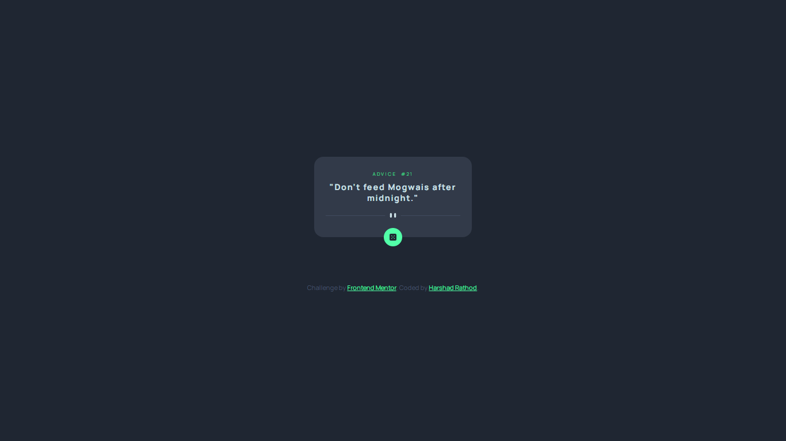

# Frontend Mentor - Advice generator app solution

This is a solution to the [Advice generator app challenge on Frontend Mentor](https://www.frontendmentor.io/challenges/advice-generator-app-QdUG-13db). Frontend Mentor challenges help you improve your coding skills by building realistic projects.

## Table of contents

- [Overview](#overview)
  - [Screenshot](#screenshot)
  - [Links](#links)
- [My process](#my-process)
  - [Built with](#built-with)
  - [What I learned](#what-i-learned)
  - [Useful resources](#useful-resources)
- [Author](#author)

## Overview

### Screenshot

### Links

- Solution URL: [Add solution URL here](https://your-solution-url.com)
- Live Site URL: [Add live site URL here](https://your-live-site-url.com)

## My process

### Built with

- Semantic HTML5 markup
- CSS custom properties
- Flexbox

### What I learned

In this challenge I learned how to connect an API using javascript. 

### Useful resources

- [https://www.taniarascia.com/how-to-connect-to-an-api-with-javascript/](https://www.taniarascia.com/how-to-connect-to-an-api-with-javascript/) - This helped me for connecting API to javascript.

## Author

- Frontend Mentor - [@harshad69](https://www.frontendmentor.io/profile/harshad69)
- Twitter - [@Hxrshxd](https://www.twitter.com/Hxrshxd)

